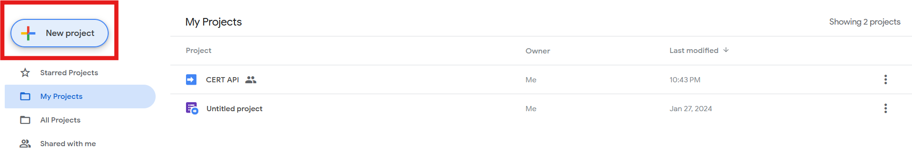
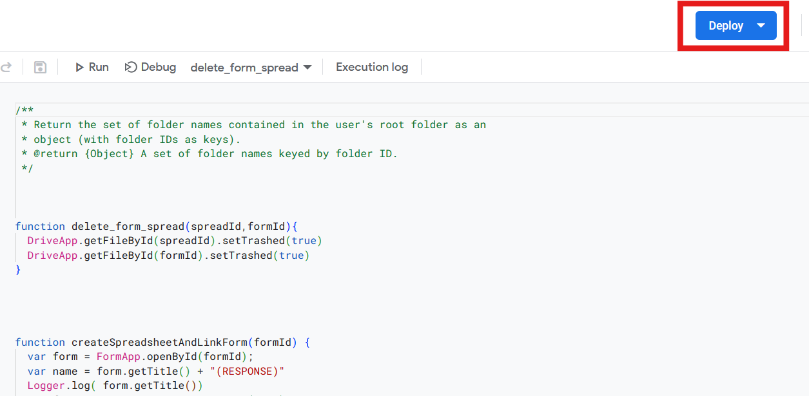
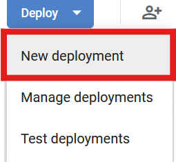
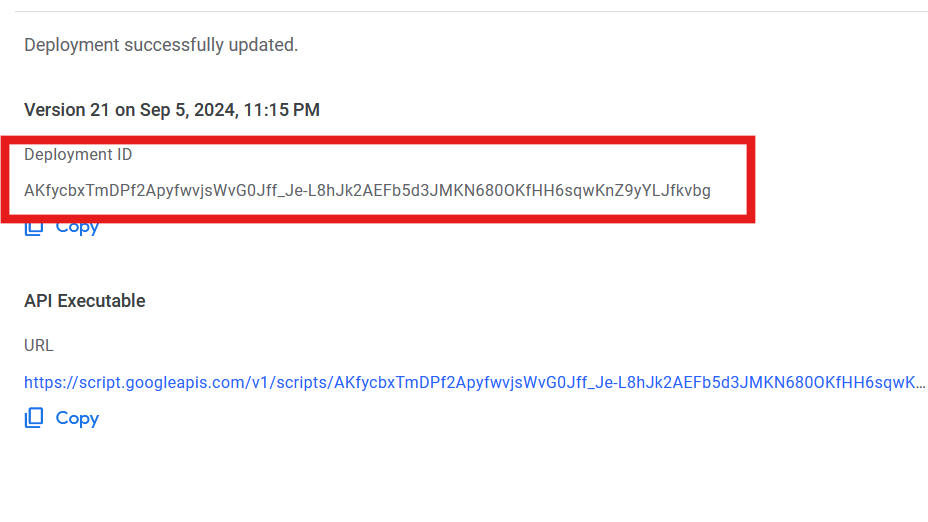

# Certificate generator

## Description

This is a Python-based application designed to automate the creation and distribution of certificates. This project leverages various libraries and frameworks, including Kivy for the user interface, PIL for image processing, and Google APIs for email sending and data retrieval.

### Features

- **Certificate Creation**: Automatically generate certificates based on predefined templates and user data.
- **Email Integration**: Send generated certificates via email using the Google API.
- **User Interface**: A Kivy-based GUI for managing certificate generation and distribution.
- **Data Handling**: Retrieve and process data from Google Sheets to populate certificate fields.
- **Customization**: Select specific columns and conditions for certificate generation.

### Project Structure

- **App-Scripts/**: Contains google app scripts code.
- **Certificate-Generator/**: Main directory containing the core application files.
  - **apis.py**: Handles API interactions.
  - **app.py**: Initializes and runs the Kivy application.
  - **Auth.py**: Manages authentication with Google APIs.
  - **certificates/**: Directory for storing generated certificates.
  - **Components/**: Contains Kivy screen components.
    - **CreateLink.py**: Handles link creation for forms.
    - **FormDetailScreen.py**: Displays form details and initiates certificate generation.
    - **FormListScreen.py**: Lists available forms.
  - **Credentials/**: Stores authentication tokens and credentials.
  - **Generator.py**: Core logic for certificate generation.
  - **helper/**: Contains helper modules.
    - **BoundedBoxer.py**: Handles bounding box calculations for certificate templates.
  - **req.txt**: Lists project dependencies.
  - **Thread_lock.py**: Manages threading and synchronization.

### Installation

- Clone the repository using the following command:
```
git clone https://github.com/The13bit/Advance-Certificate-Generator.git
```
- Install the dependencies using
  ```
  pip install -r Certificate-Generator/req.txt
  ```
- Create a google appscript project(https://script.google.com/home/start)
    
- Copy the code from App-Scripts/api.js to the project.
- Deploy the project and copy the deployment id to Script_id in .env.
  
  
  
- Create a google cloud project(https://console.cloud.google.com/)
- Go to OAuthConsent screen in Api & Services fill in the required details and set the scopes to 
 ```python
"https://www.googleapis.com/auth/forms.body"
"https://www.googleapis.com/auth/drive"
"https://www.googleapis.com/auth/script.projects"
"https://www.googleapis.com/auth/spreadsheets"
"https://www.googleapis.com/auth/forms"	
"https://www.googleapis.com/auth/presentations"
"https://www.googleapis.com/auth/gmail.send"
 ```
- Create a OAuth 2.0 client id and download the credentials.json file and paste it in the Certificate-Generator folder.
- Run app.py


### Issues
- If the terminal says Link already exist remove any google sheet containg the forms name.
  
### Contributing
-Any Contributions to the project are appreciated.


### License

This project is licensed under the MIT License.